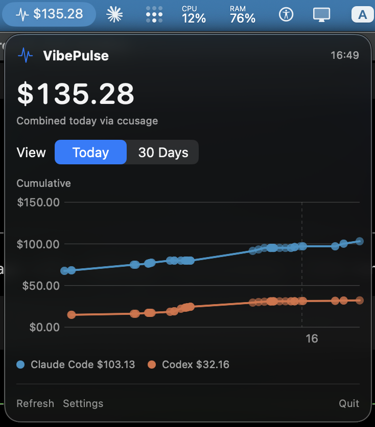
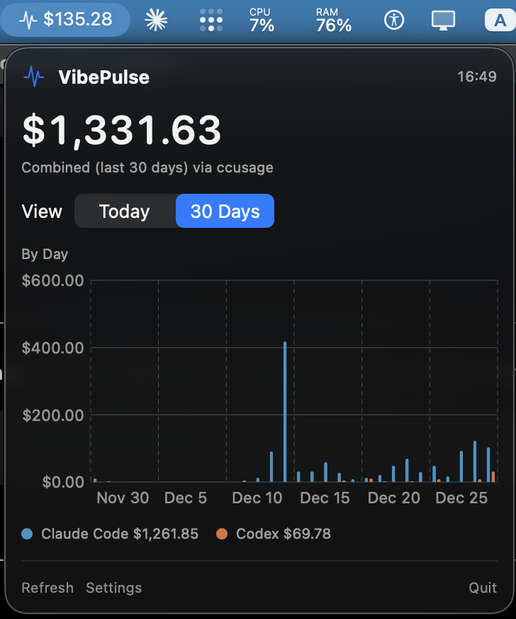
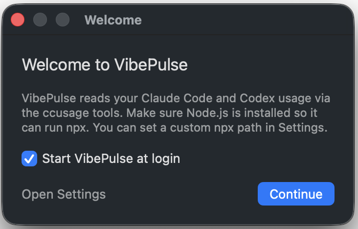
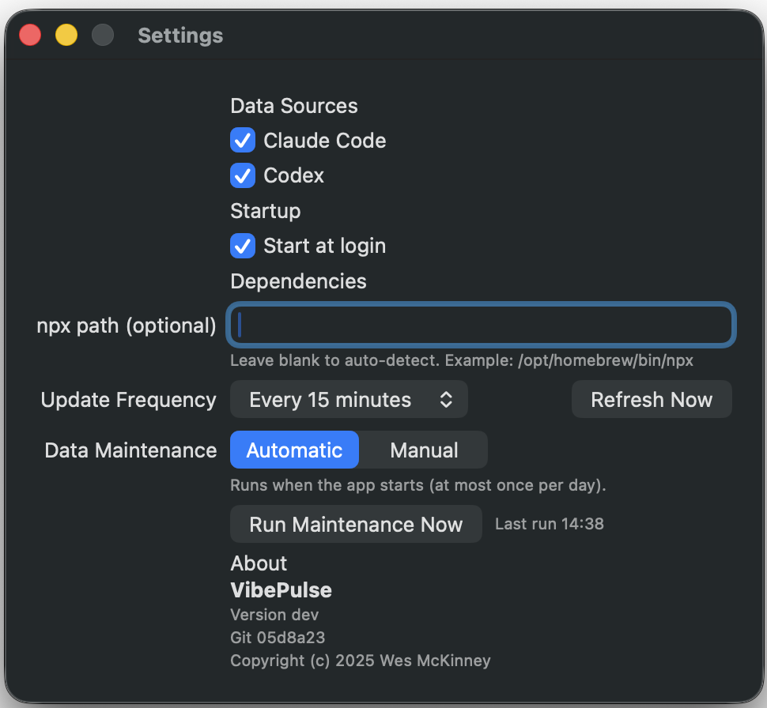

# VibePulse

VibePulse is a macOS menu bar app that tracks Claude Code + Codex token spend using the [`ccusage`](https://github.com/ryoppippi/ccusage) tools.

## Highlights

- Combined daily total in the menu bar (what you would pay per token without a subscription)
- Today view shows cumulative spend over the day
- 30-day view shows daily totals with per-tool breakdown
- Configurable refresh schedule
- Built-in data maintenance for historical imports

## Screenshots





## Requirements

- macOS 13+ (Ventura)
- Node.js (VibePulse runs `npx ccusage@latest` and `npx @ccusage/codex@latest`)
- Claude Code and/or Codex usage logs on disk

## Install

1. Download the latest `.dmg` from GitHub Releases.
2. Drag `VibePulse.app` to your Applications folder.
3. Launch it. If macOS blocks the app, open System Settings -> Privacy & Security and allow it.


Note: Releases are currently unsigned. Signed and notarized builds are planned.

## First run



- A welcome window explains the Node.js requirement, notes the default 15-minute refresh cadence, and lets you toggle start at login.
- You can revisit Settings from the menu bar at any time.

## Node.js / npx setup

VibePulse runs outside your shell, so it will not see `nvm`'s PATH unless you set an explicit `npx` path.

Recommended (least friction for menu bar apps):

```bash
brew install node
```

This installs `npx` in `/opt/homebrew/bin/npx` (Apple Silicon) or `/usr/local/bin/npx` (Intel), which VibePulse can auto-detect.

If you use `nvm`:

1. Find your `npx` path:

```bash
command -v npx
```

2. In VibePulse, open **Settings -> Dependencies** and paste that path into **npx path**.

If you change your active Node version in `nvm`, update the path in Settings.

## Settings



- **Data Sources**: Enable Claude Code and/or Codex.
- **Startup**: Start VibePulse at login (macOS may require approval).
- **Dependencies**: Set a custom `npx` path if needed.
- **Refresh**: Choose how often the app refreshes (5m, 15m, 1h, 4h, 1d).
- **Data Maintenance**: Normalize historical data and rerun import fixes.

## Security & privacy

- All usage data stays local on your machine.
- The database lives at `~/Library/Application Support/VibePulse/vibepulse.sqlite`.
- VibePulse has no analytics or telemetry.
- It runs the local `ccusage` tools via `npx` to read your logs.

## Troubleshooting

- **No data**: Run `npx ccusage@latest` or `npx @ccusage/codex@latest` in Terminal to verify logs exist.
- **npx not found**: Install Node via Homebrew or set the `npx` path in Settings -> Dependencies.
- **Start at login**: macOS may require approval in System Settings -> Login Items.

## Local development

```bash
swift run
```

## Build a DMG

```bash
scripts/build_dmg.sh v0.1.0
```

The DMG will be created in `dist/`.

## License

MIT
