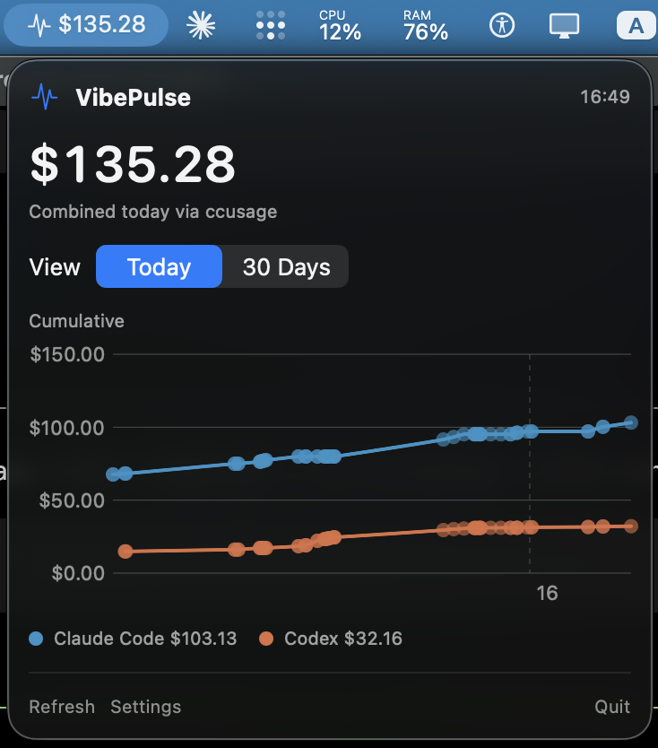
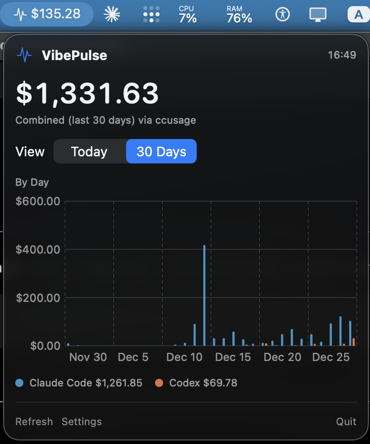
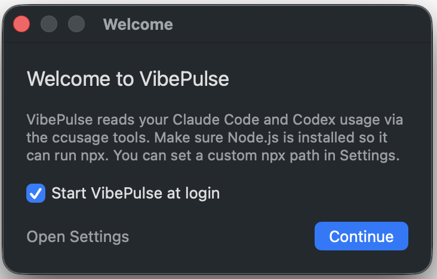
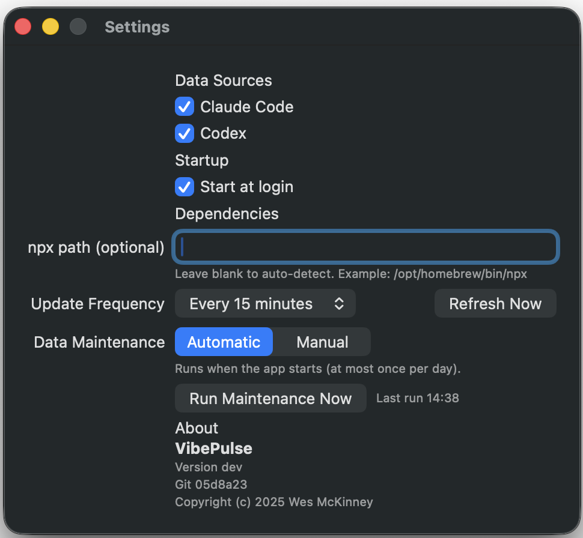

# VibePulse

VibePulse is a macOS menu bar app that tracks Claude Code + Codex token spend using [agentsview](https://github.com/wesm/agentsview).

## Highlights

- Combined daily total in the menu bar (what you would pay per token without a subscription)
- Today view shows cumulative spend over the day
- 30-day view shows daily totals with per-tool breakdown
- Configurable refresh schedule
- Built-in data maintenance for historical imports

## Screenshots

<p align="center">
  
  
</p>

## Requirements

- macOS 13+ (Ventura)
- [agentsview](https://github.com/wesm/agentsview) installed (`agentsview` on PATH or path set in Settings)
- Claude Code and/or Codex usage logs on disk

## Install

1. Download the latest `.dmg` from GitHub Releases.
2. Drag `VibePulse.app` to your Applications folder.
3. Launch it. If macOS blocks the app, open System Settings -> Privacy & Security and allow it.

## First run

<p align="center">
  
</p>

- A welcome window explains the agentsview requirement, notes the default 15-minute refresh cadence, and lets you toggle start at login.
- You can revisit Settings from the menu bar at any time.

## agentsview setup

Install agentsview:

```bash
curl -fsSL https://agentsview.io/install.sh | bash
```

This installs `agentsview` to `~/.local/bin/agentsview` or `/usr/local/bin/agentsview`.

VibePulse runs outside your shell, so if `agentsview` is installed to a non-standard location, set the path in **Settings -> Dependencies**.

## Settings

<p align="center">
  
</p>

- **Data Sources**: Enable Claude Code and/or Codex.
- **Startup**: Start VibePulse at login (macOS may require approval).
- **Dependencies**: Set a custom `agentsview` path if needed.
- **Refresh**: Choose how often the app refreshes (5m, 15m, 1h, 4h, 1d).
- **Data Maintenance**: Normalize historical data and rerun import fixes.

## Security & privacy

- All usage data stays local on your machine.
- The database lives at `~/Library/Application Support/VibePulse/vibepulse.sqlite`.
- VibePulse has no analytics or telemetry.
- It runs `agentsview usage daily --json` to read your local usage data.

## Troubleshooting

- **No data**: Run `agentsview usage daily` in Terminal to verify usage data exists.
- **agentsview not found**: Install agentsview or set the path in Settings -> Dependencies.
- **Start at login**: macOS may require approval in System Settings -> Login Items.

## Local development

```bash
swift run
```

## Build a DMG

```bash
scripts/build_dmg.sh v0.1.0
```

The DMG will be created in `dist/`.


## License

MIT
